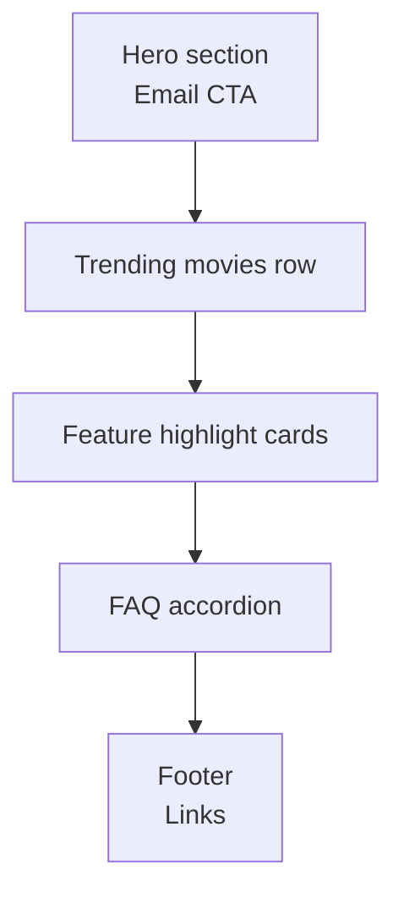

# 🎬 Netflix Clone

[](https://developer.mozilla.org/en-US/docs/Web/HTML)
[](https://developer.mozilla.org/en-US/docs/Web/CSS)
[](#tech-stack)
[](#license)

A responsive Netflix landing page clone built with **HTML5 and CSS3**, inspired by Netflix's official UI. The focus is on modern layout design, responsiveness, and clean recreation of a real-world production UI — no frameworks, no build step.

**🔗 Live Demo:** *(add your deployed link here once hosted on GitHub Pages / Vercel)*

--- 

## Table of Contents

- [Overview](#overview)
- [Page Structure](#page-structure)
- [Features](#features)
- [Tech Stack](#tech-stack)
- [Project Structure](#project-structure)
- [Screenshots](#screenshots)
- [Getting Started](#getting-started)
- [Limitations](#limitations)
- [Future Improvements](#future-improvements)
- [What This Project Demonstrates](#what-this-project-demonstrates)
- [Contributing](#contributing)
- [License](#license)
- [Author](#author)

---

## Overview

This is a static, pixel-inspired recreation of the Netflix landing page — hero section, trending row, feature highlights, FAQ, and footer — built purely in HTML and CSS to practice production-grade layout and responsive design.

## Page Structure



## Features

- Pixel-inspired Netflix UI design
- Hero section with email CTA
- Trending movies row layout
- Feature highlight cards
- FAQ accordion-style section
- Clean footer with useful links
- Fully responsive layout

## Tech Stack

| Layer | Technologies |
|---|---|
| Structure | HTML5 |
| Styling | CSS3 |
| Layout | Responsive Web Design |

## Project Structure

```text
netflix-clone/
├── screenshots/
│   ├── home-page.png
│   ├── trending-section.png
│   └── footer-section.png
├── favicon.ico
├── index.html
├── style.css
└── README.md
```

## Screenshots

<div align="center">
  <table>
    <tr>
      <td></td>
      <td></td>
    </tr>
    <tr>
      <td colspan="2" align="center"></td>
    </tr>
  </table>
</div>

## Getting Started

No build step or dependencies required — this is a static site.

```bash
git clone https://github.com/abdul-samad-001/netflix-clone.git
cd netflix-clone
start index.html
```

Or serve it locally:

```bash
python -m http.server 5500
```

Then visit [http://localhost:5500](http://localhost:5500).

## Limitations

- Static markup and CSS only — there's no JavaScript yet, so the trending row, FAQ accordion, and hover interactions are visual/CSS-only rather than fully interactive.
- Movie content is hardcoded placeholder data rather than pulled from a live source.

## Future Improvements

- Add interactive navigation links and smooth hover effects
- Integrate JavaScript sliders/carousels for movie rows
- Connect to a movies API (TMDb) for dynamic, real-time content
- Improve responsiveness for tablets and large-screen devices
- Add a dark/light mode toggle

## What This Project Demonstrates

- Responsive web design using modern CSS techniques
- Recreating real-world, production-level UI layouts
- Understanding page structure and layout hierarchy
- Building frontend clones that simulate real applications

## Contributing

Contributions are welcome. Please open an issue to discuss a change before submitting a pull request, and keep PRs focused on a single improvement or fix.

## License

This project is licensed under the MIT License. See the [LICENSE](LICENSE) file for details.

## Author

**Abdul Samad**
B.Tech — Computer Science (Artificial Intelligence & Machine Learning)

---

⭐ If you found this project helpful, consider giving it a star on GitHub!
